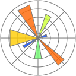

# 👩🏻‍💻 Pedro Medeiros

**`Analista de Dados`**

## Sobre Mim
Olá! Me chamo Pedro Medeiros, tenho 27 anos e sou natural de Santos, São Paulo. Após 6 anos de experiência com **Recursos Humanos e Gestão Administrativa** no setor do agronegócio, estou em transição de carreira para a **Análise de Dados**.\
Há 4 anos, me mudei para Uberlândia para assumir a responsabilidade de implantar e liderar a filial da empresa em que trabalhava — experiência que fortaleceu minha visão estratégica, liderança e minha capacidade de resolver problemas com base em dados e evidências reais.\
Atualmente estou cursando **Ciência da Computação (5º período)** e venho me especializando em **Python, SQL, PowerBI e Excel**, com foco na análise e visualização de dados.\
Meu objetivo é unir o conhecimento técnico com a bagagem profissional que construí ao longo dos anos para transformar dados em insights valiosos e contribuir com soluções orientadas por evidências.

    
    
    

---

## 🤖 Linguagens e Ferramentas

 
 

## 📊 Projetos

Abaixo você poderá ver meus projetos utilizando Python, SQL e PowerBI

  <!-- Projeto 1 -->
  <a href="https://github.com/PedroCanhete/Projeto-RH" width="300px" height="200px" target="_blank" class="card">
    
    

      <h3>Análise de Triagem de Candidatos</h3>
      
Classificação de perfis com base em dados de RH

    

  </a>

  <!-- Projeto 2 -->
  <a href="https://github.com/PedroCanhete/Dashboard-TrafegoPago" width="300px" height="200px" target="_blank" class="card">
    
    

      <h3>Análise de Tráfego Pago</h3>
      
Análise de campanhas de tráfego pago de uma agência de marketing.

    

  </a>

  <!-- Projeto 3 -->
  <a href="https://github.com/PedroCanhete/Dashboard-Logistica" width="300px" height="200px" target="_blank" class="card">
    
    

      <h3>Análise de Performance Logística</h3>
      
Análise de performance em uma dashboard logística com os principais KPIs.

    

  </a>

  <!-- Projeto 4 -->
  <a href="https://github.com/PedroCanhete/Dashboard-Vendas" width="300px" height="200px" target="_blank" class="card">
    
    

      <h3>Análise de Vendas em E-Commerce</h3>
      
Análise de vendas com os principais KPIs de um e-commerce.

    

  </a>

  <!-- Projeto 5 -->
  <a href="https://github.com/PedroCanhete/Dashboard-Marketing" width="300px" height="200px" target="_blank" class="card">
    
    

      <h3>Análise de Campanhas de Marketing</h3>
      
Análise de campanhas de marketing digital, avaliando performance visando o impulsionamento de métricas para aumentar a jornada dos clientes nos portais.

    

  </a>

  <!-- Projeto 6 -->
  <a href="https://github.com/PedroCanhete/Analise-de-Credito" width="300px" height="200px" target="_blank" class="card">
    
    

      <h3>Análise de Churn Bancário</h3>
      
Análise de dados voltado para diminuir e prever os possíveis "Churns" de um banco.

    

  </a>

